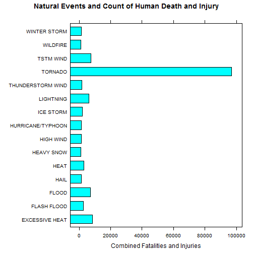
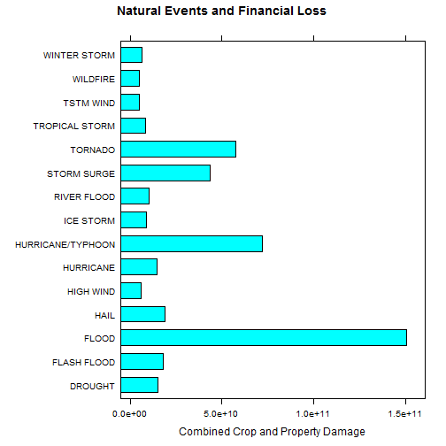

Overwheming destructive force of Tornados from 1950-2011
========================================================

### Synopsis

In an effort to better prepare for natural disasters in the United States, we've aggregated disaster reports from the U.S. National Oceanic and Atmospheric Administration's (NOAA) storm database (1950-2011) to look for events that are most harmful financially and physically.  The findings indicate that tornadoes are the combined worst natural disasters we face.  Not only do they cause the most harm to human beings, they are top five worst in financial burden and top five most frequently occurring.

### Data Processing


```r
stormData <- read.csv("StormData.bz2")
```


Since we're going to be focused on analyzing the event type's (EVTYPE) impact against health and economic livelihood of the population, we can start by checking to make sure we have the columns properly named and typed.


```r
colnames(stormData)
```

```
##  [1] "STATE__"    "BGN_DATE"   "BGN_TIME"   "TIME_ZONE"  "COUNTY"    
##  [6] "COUNTYNAME" "STATE"      "EVTYPE"     "BGN_RANGE"  "BGN_AZI"   
## [11] "BGN_LOCATI" "END_DATE"   "END_TIME"   "COUNTY_END" "COUNTYENDN"
## [16] "END_RANGE"  "END_AZI"    "END_LOCATI" "LENGTH"     "WIDTH"     
## [21] "F"          "MAG"        "FATALITIES" "INJURIES"   "PROPDMG"   
## [26] "PROPDMGEXP" "CROPDMG"    "CROPDMGEXP" "WFO"        "STATEOFFIC"
## [31] "ZONENAMES"  "LATITUDE"   "LONGITUDE"  "LATITUDE_E" "LONGITUDE_"
## [36] "REMARKS"    "REFNUM"
```


Health impact would likely be measured best in number of fatalities and injuries (FATALITIES and INJURIES as the respective column names).

For the economic analysis we have PROPDMG and CROPDMG and their exp values in PROPDMGEXP and CROPDMGEXP


```r
unique(stormData$PROPDMGEXP)
```

```
##  [1] K M   B m + 0 5 6 ? 4 2 3 h 7 H - 1 8
## Levels:  - ? + 0 1 2 3 4 5 6 7 8 B h H K m M
```


Since the values have ranges from K, M, B to 1-9, we can assume K, M, B for thousand, million, billion and 1-9 as 10^n.  Now subset the columns we are taking to be relevant to the investigation, get rid of any zero values that we don't need.


```r
st <- subset(stormData, FATALITIES > 0 | INJURIES > 0 | PROPDMG > 0 | CROPDMG > 
    0, select = c("STATE__", "BGN_DATE", "END_DATE", "EVTYPE", "FATALITIES", 
    "INJURIES", "PROPDMG", "PROPDMGEXP", "CROPDMG", "CROPDMGEXP"))
```


Let's total up the fatalities and injuries


```r
st$totalHealth <- st$FATALITIES + st$INJURIES
```


Now convert the dollar amounts for crop and property damage.


```r
st$propdamage <- st$PROPDMG
st$PROPDMGEXP <- as.character(st$PROPDMGEXP)
st$PROPDMGEXP[tolower(st$PROPDMGEXP) == "h"] <- "2"
st$PROPDMGEXP[tolower(st$PROPDMGEXP) == "k"] <- "3"
st$PROPDMGEXP[tolower(st$PROPDMGEXP) == "m"] <- "6"
st$PROPDMGEXP[tolower(st$PROPDMGEXP) == "b"] <- "9"
st$PROPDMGEXP[st$PROPDMGEXP == "" | st$PROPDMGEXP == "-" | st$PROPDMGEXP == 
    "?" | st$PROPDMGEXP == "+"] <- "0"
st$PROPDMGEXP <- as.numeric(st$PROPDMGEXP)
st$propdamage <- (10^st$PROPDMGEXP) * st$PROPDMG
```


```r
st$cropdamage <- st$CROPDMG
st$CROPDMGEXP <- as.character(st$CROPDMGEXP)
st$CROPDMGEXP[tolower(st$CROPDMGEXP) == "h"] <- "2"
st$CROPDMGEXP[tolower(st$CROPDMGEXP) == "k"] <- "3"
st$CROPDMGEXP[tolower(st$CROPDMGEXP) == "m"] <- "6"
st$CROPDMGEXP[tolower(st$CROPDMGEXP) == "b"] <- "9"
st$CROPDMGEXP[st$CROPDMGEXP == "" | st$CROPDMGEXP == "-" | st$CROPDMGEXP == 
    "?" | st$CROPDMGEXP == "+"] <- "0"
st$CROPDMGEXP <- as.numeric(st$CROPDMGEXP)
st$cropdamage <- (10^st$CROPDMGEXP) * st$CROPDMG
```


Let's also total up the damage amounts


```r
st$totalDamage <- st$cropdamage + st$propdamage
```


We will now sum up all relevant columns that are necessary to determine the worst disasters.


```r
onlySums <- st[, c("EVTYPE", "FATALITIES", "INJURIES", "propdamage", "cropdamage", 
    "totalDamage", "totalHealth")]
agged <- aggregate(. ~ EVTYPE, onlySums, sum)
```


### Results

#### Health Impact

Now we can begin to look at the health impact by environmental disaster.


```r
topFifteen <- head(agged[order(-agged$totalHealth), c("EVTYPE", "totalHealth")], 
    15)
topFifteen
```

```
##                EVTYPE totalHealth
## 407           TORNADO       96979
## 61     EXCESSIVE HEAT        8428
## 423         TSTM WIND        7461
## 86              FLOOD        7259
## 258         LIGHTNING        6046
## 151              HEAT        3037
## 73        FLASH FLOOD        2755
## 238         ICE STORM        2064
## 364 THUNDERSTORM WIND        1621
## 481      WINTER STORM        1527
## 200         HIGH WIND        1385
## 134              HAIL        1376
## 224 HURRICANE/TYPHOON        1339
## 170        HEAVY SNOW        1148
## 471          WILDFIRE         986
```


Based on the total counts above, tornadoes have the worst impact on human life when combining injury and fatalities.  Let's plot the event types out to get a better sense of scale.


```r
library(lattice)
barchart(data = topFifteen, EVTYPE ~ totalHealth, xlab = "Combined Fatalities and Injuries", 
    main = "Natural Events and Count of Human Death and Injury")
```

 


To make sure the top fifteen results aren't getting skewed by either the injury or fatality counts, lets order by both measureables and compare the top fifteen.


```r
head(agged[order(-agged$FATALITIES), c("EVTYPE", "FATALITIES")], 15)
```

```
##                EVTYPE FATALITIES
## 407           TORNADO       5633
## 61     EXCESSIVE HEAT       1903
## 73        FLASH FLOOD        978
## 151              HEAT        937
## 258         LIGHTNING        816
## 423         TSTM WIND        504
## 86              FLOOD        470
## 306       RIP CURRENT        368
## 200         HIGH WIND        248
## 11          AVALANCHE        224
## 481      WINTER STORM        206
## 307      RIP CURRENTS        204
## 153         HEAT WAVE        172
## 67       EXTREME COLD        160
## 364 THUNDERSTORM WIND        133
```

```r
head(agged[order(-agged$INJURIES), c("EVTYPE", "INJURIES")], 15)
```

```
##                EVTYPE INJURIES
## 407           TORNADO    91346
## 423         TSTM WIND     6957
## 86              FLOOD     6789
## 61     EXCESSIVE HEAT     6525
## 258         LIGHTNING     5230
## 151              HEAT     2100
## 238         ICE STORM     1975
## 73        FLASH FLOOD     1777
## 364 THUNDERSTORM WIND     1488
## 134              HAIL     1361
## 481      WINTER STORM     1321
## 224 HURRICANE/TYPHOON     1275
## 200         HIGH WIND     1137
## 170        HEAVY SNOW     1021
## 471          WILDFIRE      911
```


In both cases tornadoes were clearly more destructive.

Let's also check out the frequency of these disasters.


```r
freqs <- as.data.frame(with(onlySums, table(EVTYPE)))
head(freqs[order(-freqs$Freq), c("EVTYPE", "Freq")], 15)
```

```
##                 EVTYPE  Freq
## 856          TSTM WIND 63234
## 760  THUNDERSTORM WIND 43655
## 834            TORNADO 39944
## 244               HAIL 26130
## 153        FLASH FLOOD 20967
## 464          LIGHTNING 13293
## 786 THUNDERSTORM WINDS 12086
## 170              FLOOD 10175
## 359          HIGH WIND  5522
## 676        STRONG WIND  3370
## 972       WINTER STORM  1508
## 310         HEAVY SNOW  1342
## 290         HEAVY RAIN  1105
## 957           WILDFIRE   857
## 427          ICE STORM   708
```


#### Economic Impact

We already have all of the event types aggregated, so we can take a look at the top fifteen worst disasters by economic impact (the combined dollar amount of estimated crop and property damage).


```r
topFifteenProp <- head(agged[order(-agged$totalDamage), c("EVTYPE", "totalDamage")], 
    15)
topFifteenProp
```

```
##                EVTYPE totalDamage
## 86              FLOOD   1.503e+11
## 224 HURRICANE/TYPHOON   7.191e+10
## 407           TORNADO   5.736e+10
## 350       STORM SURGE   4.332e+10
## 134              HAIL   1.876e+10
## 73        FLASH FLOOD   1.824e+10
## 49            DROUGHT   1.502e+10
## 215         HURRICANE   1.461e+10
## 310       RIVER FLOOD   1.015e+10
## 238         ICE STORM   8.967e+09
## 417    TROPICAL STORM   8.382e+09
## 481      WINTER STORM   6.715e+09
## 200         HIGH WIND   5.909e+09
## 471          WILDFIRE   5.061e+09
## 423         TSTM WIND   5.039e+09
```


Flooding ranks highest on the total financial damage list.  Again, we can plot this information to get a sense of how much more destructive floods were than any other disaster.

```r
barchart(data = topFifteenProp, EVTYPE ~ totalDamage, xlab = "Combined Crop and Property Damage", 
    main = "Natural Events and Financial Loss")
```

 


Based on this information, floods have cost roughly 6 billion dollars more than the next leading disaster candidate, hurricanes.

To get a better sense of the types of events that impact property vs crop damage, let's sort the list by each damage type.


```r
head(agged[order(-agged$cropdamage), c("EVTYPE", "cropdamage")], 15)
```

```
##                EVTYPE cropdamage
## 49            DROUGHT  1.397e+10
## 86              FLOOD  5.662e+09
## 310       RIVER FLOOD  5.029e+09
## 238         ICE STORM  5.022e+09
## 134              HAIL  3.026e+09
## 215         HURRICANE  2.742e+09
## 224 HURRICANE/TYPHOON  2.608e+09
## 73        FLASH FLOOD  1.421e+09
## 67       EXTREME COLD  1.293e+09
## 114      FROST/FREEZE  1.094e+09
## 159        HEAVY RAIN  7.334e+08
## 417    TROPICAL STORM  6.783e+08
## 200         HIGH WIND  6.386e+08
## 423         TSTM WIND  5.540e+08
## 61     EXCESSIVE HEAT  4.924e+08
```

```r
head(agged[order(-agged$propdamage), c("EVTYPE", "propdamage")], 15)
```

```
##                EVTYPE propdamage
## 86              FLOOD  1.447e+11
## 224 HURRICANE/TYPHOON  6.931e+10
## 407           TORNADO  5.695e+10
## 350       STORM SURGE  4.332e+10
## 73        FLASH FLOOD  1.682e+10
## 134              HAIL  1.574e+10
## 215         HURRICANE  1.187e+10
## 417    TROPICAL STORM  7.704e+09
## 481      WINTER STORM  6.688e+09
## 200         HIGH WIND  5.270e+09
## 310       RIVER FLOOD  5.119e+09
## 471          WILDFIRE  4.765e+09
## 351  STORM SURGE/TIDE  4.641e+09
## 423         TSTM WIND  4.485e+09
## 238         ICE STORM  3.945e+09
```


Not surprisingly, drought was the worst killer of crops with flooding close behind.

